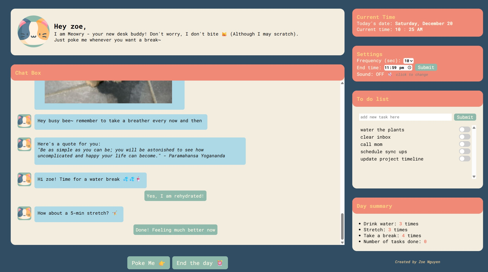
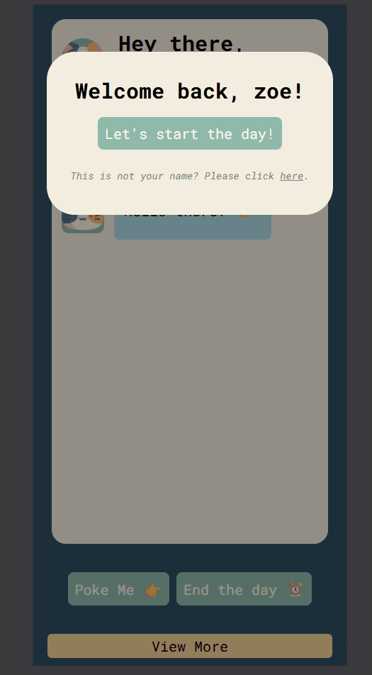
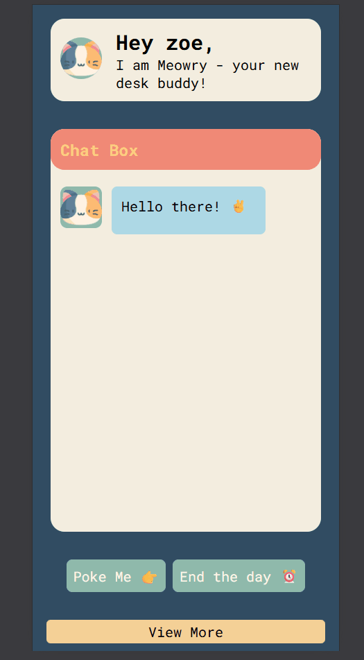

# 🐱 Desk Buddy — Your Virtual Productivity Companion

💻 **Live Demo:** [Desk Buddy on GitHub Pages](https://zoenguyen73.github.io/Desk-Buddy/src/index.html)  
🔗 **Backend (Netlify Function):** [Humor API Proxy](https://desk-buddy.netlify.app/.netlify/functions/humor-api)

---

## 🧭 Overview

Desk Buddy is a **virtual coworker** that makes remote work more engaging.  
It chats with you throughout the day - sending light-hearted reminders, jokes, and memes to keep you productive and motivated.

---

## 🚀 Features

- 🕒 **Timer-based events** with configurable message frequency
- 💬 **Interactive chat interface** with system and user messages
- 😂 **Random jokes & memes** fetched securely via Netlify Functions
- 💧 **Stretch / water / break reminders** with corresponding user responses
- 📝 **Simple to-do list** for daily task tracking
- 🕹️ **End-of-day summary** message
- 🔊 **Notification sounds** for new chat messages

---

## 🧰 Tech Stack

| Category                | Tools / Libraries                                                 |
| ----------------------- | ----------------------------------------------------------------- |
| **Frontend**            | HTML, CSS (Flexbox + responsive), Vanilla JavaScript (ES Modules) |
| **Backend / API Proxy** | Netlify Functions (serverless)                                    |
| **External APIs**       | icanhazdadjoke, Meme API, ZenQuotes, Humor API                    |
| **Hosting**             | GitHub Pages (frontend), Netlify (backend)                        |
| **Storage**             | Local Storage (for caching quotes and remembering username)       |

---

## 🧠 Development Process & Key Learnings

Desk Buddy began as my **first end-to-end web project** to apply fundamental web-dev concepts while learning modular design.

**Core Concepts Practised**

- Object-Oriented Programming for cleaner component separation
- Event-driven architecture connecting the Timer, ChatComponent, and Event classes
- Asynchronous logic for API calls and user interactions
- Secure API key handling via Netlify Functions
- Responsive layout and polished UX (details like loading states and reaction emojis)

---

## 🧩 Technical Highlights & Challenges

| Area                          | Approach / Solution                                                                           |
| ----------------------------- | --------------------------------------------------------------------------------------------- |
| **Event timing logic**        | Implemented a recursive `setTimeout()` loop to schedule chat events dynamically.              |
| **Async API delays**          | Added loading cursors and disabled buttons until responses render.                            |
| **Data flow between modules** | Centralized configuration object and event list for state management.                         |
| **DOM organization**          | Built `Message`, `MessageWithClickEvent`, and `ChatComponent` classes for structured updates. |
| **Styling issues**            | Leveraged Flexbox and absolute positioning for chat layout and reaction emoji placement.      |

---

## 💡 Lessons Learned

- Think in **components** and separate concerns early, even in vanilla JS.
- **Visualize data flow** between modules to reduce state bugs.
- Handle asynchronous events gracefully with user feedback.
- Keep API keys secure by off-loading calls to serverless functions.
- Maintain clear commits and documentation for scalability.

---

## 🧪 Future Improvements

- 🎵 Spotify API integration for background music
- 🤖 AI-powered chat responses (personalized buddy conversations)
- 🎨 Theme & avatar customization
- 🗓️ Scheduled auto-start / auto-end sessions
- 🗒️ Built-in notepad for quick ideas

---

## 🧑‍💻 Author

**Zoe Nguyen** — Aspiring Full-Stack Developer  
🌐 [Portfolio Website](#) 💼 [LinkedIn](https://www.linkedin.com/in/zoe-nguyen-ndnn/) 📫 nganguyen0703@gmail.com

---

## 📸 Screenshots

| Web UI                                                     | Mobile Chat Interface                                                  | Mobile To-do List                                                  |
| ---------------------------------------------------------- | ---------------------------------------------------------------------- | ------------------------------------------------------------------ |
|  |  |  |

---

### 📈 Summary

Desk Buddy demonstrates my ability to:

- Design and structure an interactive frontend from scratch
- Integrate external APIs securely via serverless architecture
- Combine technical execution with playful UX and clean code
